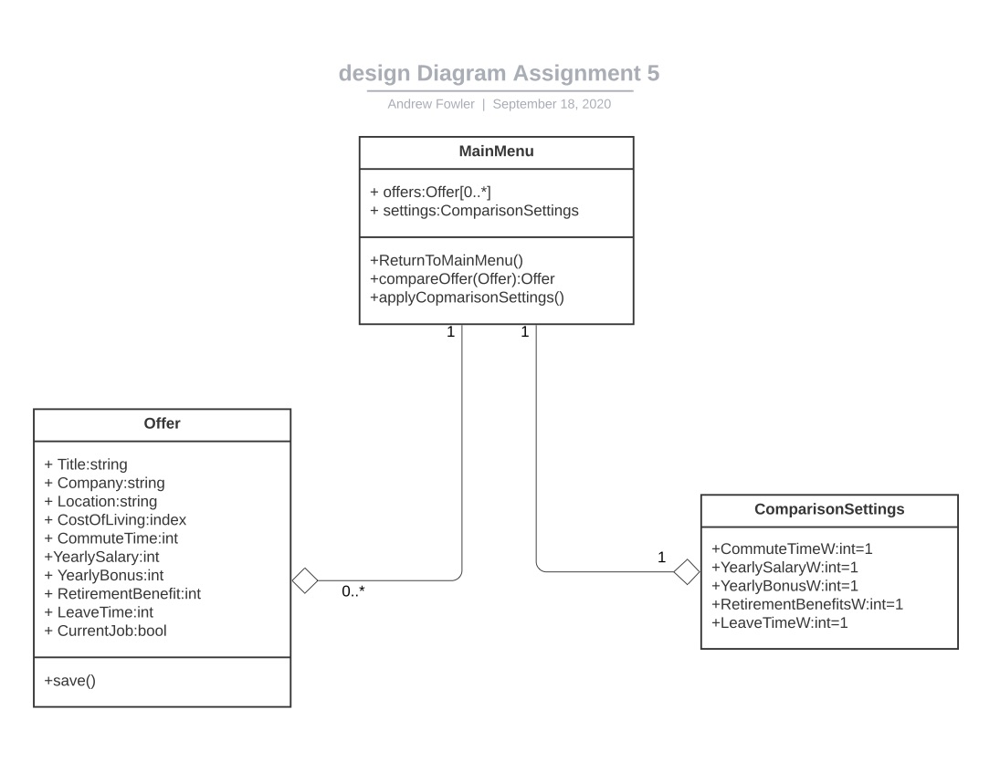
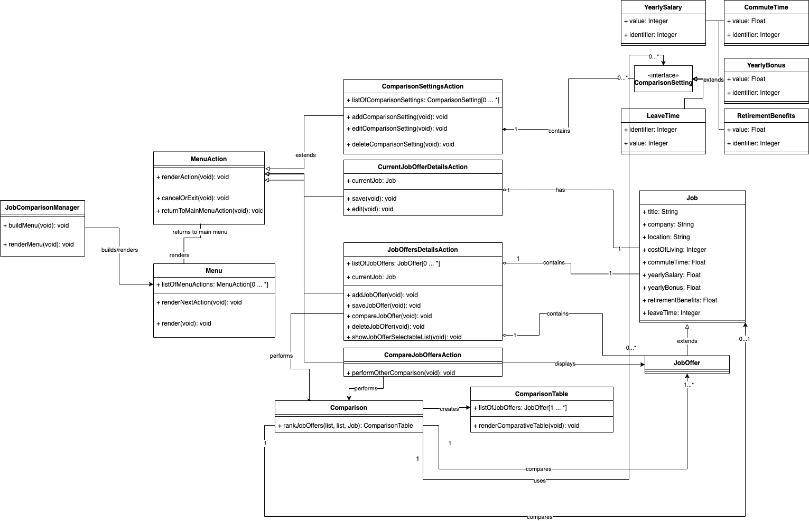
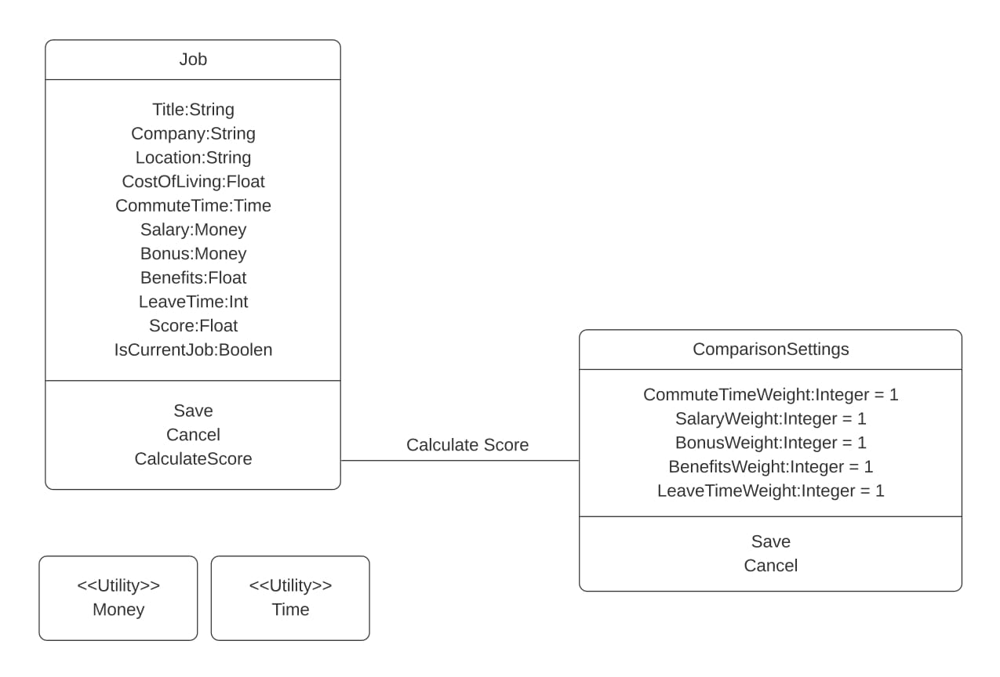
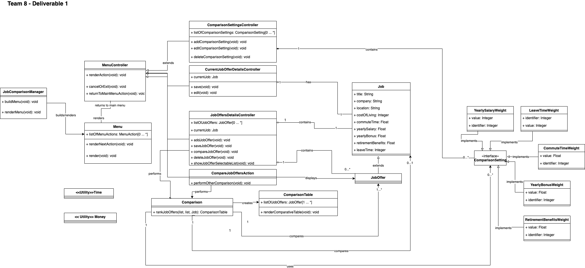

# Design 1
Author: afowler37
 
## Pros
- Easy to read
- Main menu as a starting point
## Cons
- Missing utility classes
- Missing a composition class for comparison settings instead of an aggregation
- Add labels to the relationships.
# Design 2
Author: eplaza3

## Pros
- Split up into business classes
- Definitely closer to the real code
- Comparison logic is split up for extra usability
- All of the attributes are set up for future changes as classes
- MVC pattern
- Labeled correctly.
## Cons
- Busy - fix upper right corner
- Add utility classes Time and Money
- rename action to controller class so it doesn't sound like an action class.
# Design 3
Author: aruth7

## Pros
- Created utility classes - especially time. 
- A stored job score
## Cons
- Missing types and private/public methods and return types.
- Too simple
## Other
MVNN process was used
Placeholder
# Design 4
Author: jmelius3

## Pros
- Utility classes
- Job details and job offer extends from job details
## Cons
- Menu does not connect to anything else.
# Team Design

All designs accounted for all requirements and were very similar in nature. However, some of the designs were highly coupled and did not account for code reusability.
So, after carefully analyzing all 4 diagrams, we decided to choose Design #2.
Design #2 followed the Model View Controller (MVC) pattern, which would allow us to easily modify our implementation, without having to make degrading changes to the architecture.
We wanted to abstract away the business logic from the Application's visual features(View) and the Persistent layer(Storage Database), which is something that the MVC pattern was created for.
This design was conceived keeping in mind code reusability. Having the Model, the View, and the Controller as separate layers would allow us to implement different views for other systems later on. For example, we could reuse the Model and Controller to design a Java Servlet, all we would need to do is to implement a View layer.
The other important feature that we liked from Design #2 was that all the requirements were accounted for by either using methods or classes.
To summarize:
The team decided to add the following improvements to Design #2:
- Utility classes for time and money
- Change a few names to be more descriptive. e.g. Action-labeled classes in Design #2 were relabeled to Controller
- Organized the Comparison Settings classes to make the design more legible for all team members
Note: more about the MVC pattern can be found here: [Model View Controller](https://en.wikipedia.org/wiki/Model%E2%80%93view%E2%80%93controller)
# Summary
In general we only included things we actually needed to include. We left out implementation details and any gui-specific details.
Nobody put in the non-functional requirements in our UML diagrams.
After discussing all 4 diagrams and interacting with each other, we learnt that we can benefit from using Design Patterns and modularizing the architecture.
We also learnt that code reusability is crucial to succeed in the case of rapid requirement changes.
Another important lesson was that in order to collaborate efficiently we have to use the Github repo carefully to be mindful of previous work pushed by other team members.
Finally, in terms of group meetings, it’s important to check all the team member’s time zones to be able to schedule meetings, so all the members are able to join.
