# Design Document

**Author**: Team 008

## 1 Design Considerations

The subsections below will explain and assumptions, constraints and the environment the development team will be working in.

### 1.1 Assumptions
The first assumption is developers are familiar with the Android Development Studio and git version control software. We assume we will have no problems accessing software we need, or the internet to submit the project. We will have dependencies on Java SDK 29 as well as Juinit which we will use for testing. We also assume we will have enough time to complete the project on schedule with our four person team. We also assume the scope will not dramatically change as the project goes on. The design document currently approved along with a few possible changes is all we have currently planned for.

### 1.2 Constraints
This app will only work on Android phones running version 9.0 or later. This constraint means we will be using Android Studio 4 for all development as well as testing. The main language being used will also be java which may not be portable to other operating systems. We are also constained to using the private group github set up. 

### 1.3 System Environment
The system must be running Android 9.0 or more recent for the operating system. The hardware must have a touch screen interface which ideally has a resolution of 1920x1080 and be able to accept user input.

## 2 Architectural Design
Here we will discuss the various high-level design elements of the system and help give an understanding of how elements will interact with each other. 

### 2.1 Component Diagram
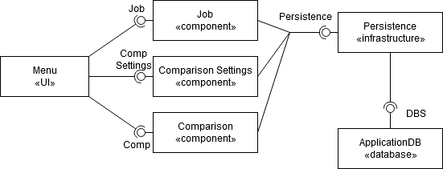

The image above shows how the different components of the application will interact at a high level. The GUI will provide an way for the user to utilize the interfaces provided by the Job, Comparison, and Comparison Settings components. We will be using sqlite to provide data persistence to the appropriate parts of the app as needed.

### 2.2 Deployment Diagram
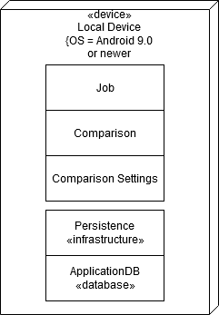

The image above illustrates that all of the components will be deployed onto the android device. There will be no outside server to host services for our application.

## 3 Low-Level Design
The low level components described here will be detailed in the following subsections. 

The main application components are as follows:
* Menu/GUI - User interface to allow navigation between multiple screens and for data entry and retrieval using the Job, Comparison, and Comparison Setting component features.
* Job - Component that will be a controller that accepts job data from the GUI per its per its requirements.
* Comparison - Component that will run a series of calculations on the data that has been previously stored and rank the job offers. 
* Comparison Settings - Component that will accept user specified options to modify how the comparisons of jobs are made. 
* Persistence - Infrastructure to make sure that all data is secure, sanitized, and ready to store in the database system.
* ApplicationDB - SQLite database to hold data specified by the user between sessions. This will allow the user to save data when the application is closed.

### 3.1 Class Diagram
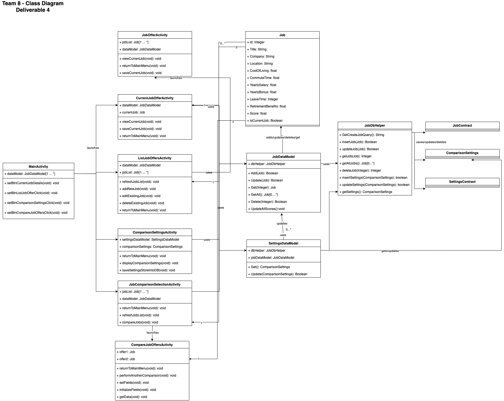

### 3.2 Other Diagrams
We did not create any other diagrams to describe the system usage.

## 4 User Interface Design
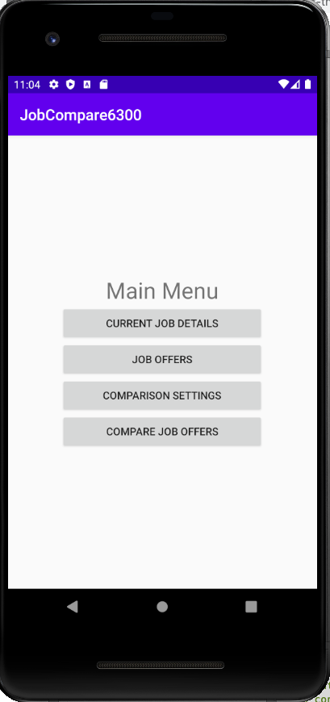
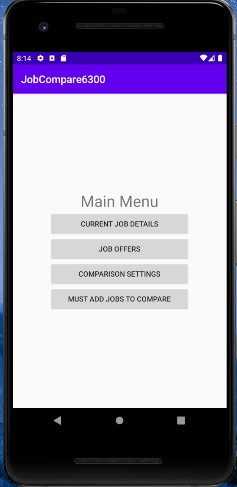
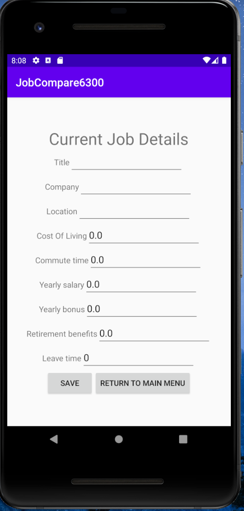
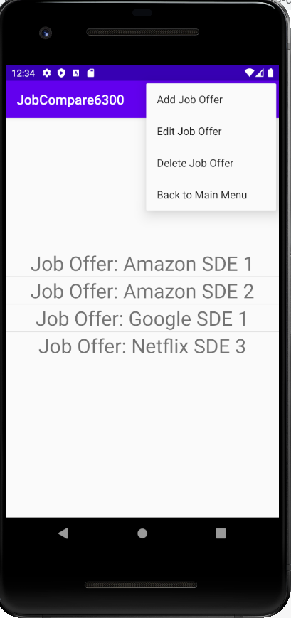
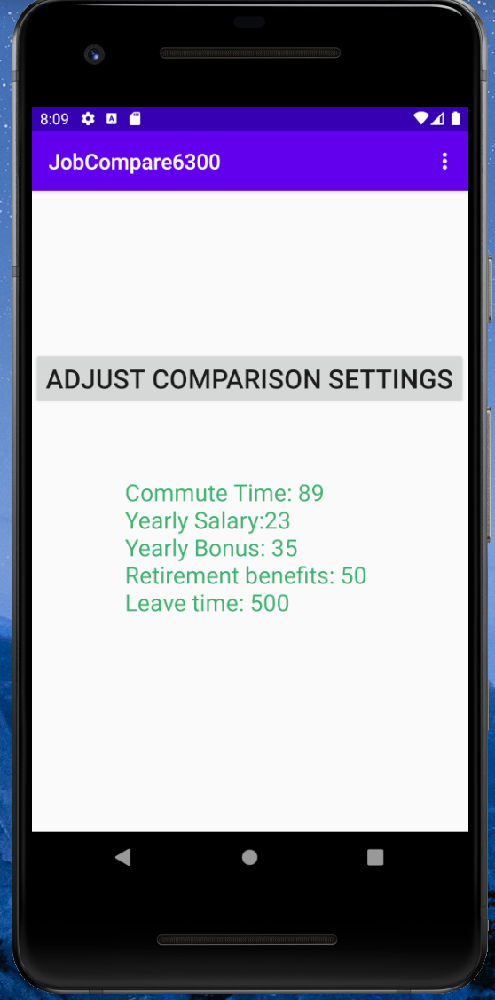
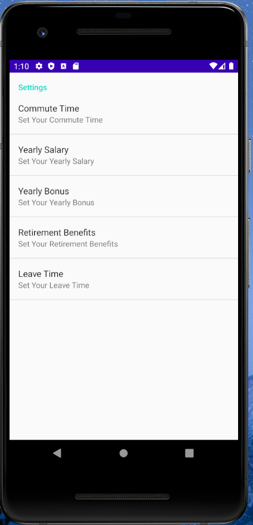
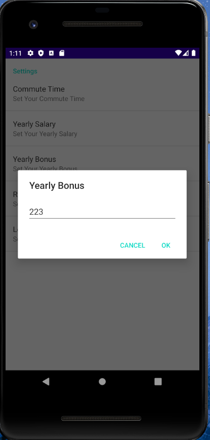
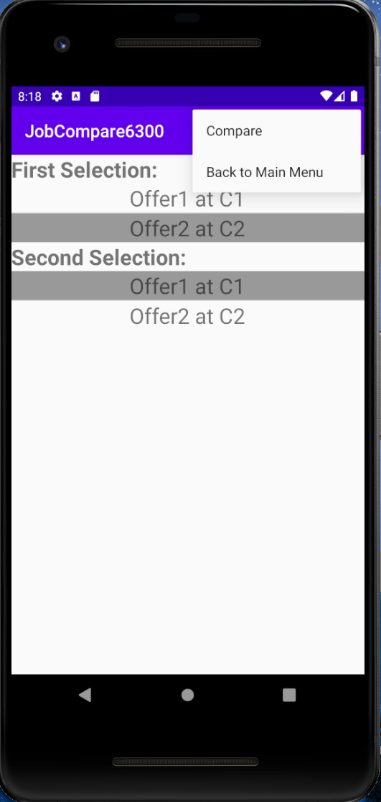
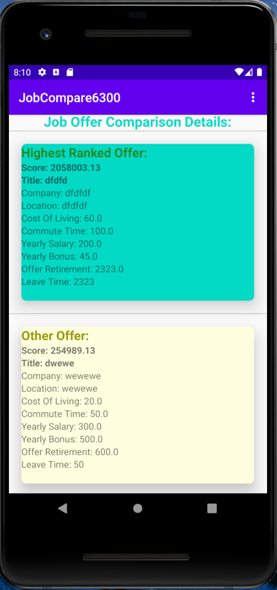

