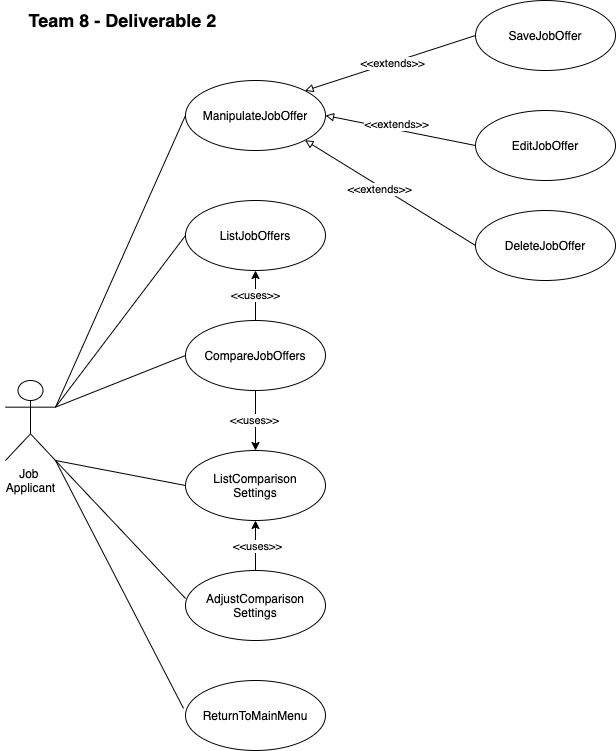

# Use Case Model

This use case model was defined to satisfy the Job App Search requirements.

**Author**: Team 008

## 1 Use Case Diagram

## 2 Use Case Descriptions

- Use case ManipulateJobOffer
 - Requirements:
 This use case will be implementing the abstract functionality of performing an action on a job offer
 - Pre-conditions:
 The user decides to save, edit or delete a job offer
 - Post-conditions:
 The user is able to save, edit or delete a job offer
 - Scenarios:
  Main: User decides to perform an action on a Job Offer, in which case the results of the action performed are be executed
  Alternative:  User decides to cancel an action on a Job Offer, in which case the results of the action performed is not be executed
 
- Use case SaveJobOffer
 - Requirements:
 This use case will be implementing the concrete functionality of saving a Job Offer. This use case extends from ManipulateJobOffer
 - Pre-conditions:
 The user decides to save a job offer
 The job offer to be added does not exist
 - Post-conditions:
 The user is able to persist a job offer
 - Scenarios:
  Main: User decides to save a Job Offer, in which case the job offer is saved
  Alternative: User decides to cancel saving a Job Offer, in which case the offer is not saved
 
- Use case EditJobOffer
 - Requirements:
 This use case will be implementing the concrete functionality of saving a Job Offer. This use case extends from ManipulateJobOffer
 - Pre-conditions:
 The user decides to edit a job offer
 The job offer to be edited exists
 - Post-conditions:
 The user is able to persist changes associated with a job offer
 - Scenarios:
  Main: User decides to save a Job Offer, in which case the job offer is edited
  Alternative: User decides to cancel saving a Job Offer, in which case the offer changes are not saved
 
- Use case DeleteJobOffer
 - Requirements:
 This use case will be implementing the concrete functionality of saving a Job Offer. This use case extends from ManipulateJobOffer
 - Pre-conditions:
 The user decides to delete a job offer
 The job offer to be deleted exists
 - Post-conditions:
 The user is able to delete a job offer
 - Scenarios:
  Main: User decides to save a Job Offer, in which case the job offer is deleted
  Alternative: User decides to cancel saving a Job Offer, in which case the offer is not deleted
 
- Use case ListJobOffers
 - Requirements:
 This use case will be implementing the action of listing job offers
 - Pre-conditions:
 The user decides to list a job offer
 There is at least one job offer previously saved
 - Post-conditions:
 The user is able to see all the job offers that he/she previously saved
 - Scenarios:
  Main: User is able to see a complete list with all the offers, and their details
  Alternative: User sees an empty list and a warning message, so he/she knows that he/she needs to add job offers

- Use case CompareJobOffers
 - Requirements:
 This use case will be implementing the action of comparing job offers
 - Pre-conditions:
 The user decides to compare job offers
 There are at least 2 offers to be compared. Either: a Job Offer and a Current Job or 2 Job Offers
 This use case requires a list of comparison settings or the default settings
 The user needs to choose offer to be compared
 - Post-conditions:
 A comparison is performed, the comparison must implement the algorithm described in the [requirement doc](https://docs.google.com/document/d/1iuyjpgr8nXKklR1gqKJ7CNW_Tf79dhqRZ78z38RO3Cc/edit)
 - Scenarios:
  Main: User is able the offers' comparison
  Alternative: In the case that any of the requirements are not met, display an error message. e.g. no offers selected or not comparison setting present

- Use case ListComparisonSettings
 - Requirements:
 This use case will be implementing the action of seeing the current comparison settings
 - Pre-conditions:
 The user decides to see the comparison settings
 - Post-conditions:
 If no comparison setting were set, then show list of default comparison values
 - Scenarios:
  Main: User is able see comparison settings
  Alternative: No comparison settings present, the system will show default settings

- Use case AdjustComparisonSettings
 - Requirements:
 This use case allows changing comparison settings
 - Pre-conditions:
 The user decides to set the comparison settings
 The user is presented with the comparison settings that he/she wants to set
 - Post-conditions:
 The comparison settings will be set to the values specified by the user
 - Scenarios:
  Main: User is able set comparison settings
  Alternative: If an error occurs, then the system must be able to revert to the default comparison settings
 
- Use case ReturnToMainMenu
 - Requirements:
 This use case allows the user to return to the main menu, cancelling any actions he/she might had performed
 - Pre-conditions:
 The user must be working on an action. e.g. saving job offers, etc to be able to go back to the main menu
 - Post-conditions:
 Changes the user made in the current screen are cancelled
 The user is able to return to the Main Menu
 - Scenarios:
  Main: User is able to cancel the changes and return to the main menu
  Alternative: The user decides to continue working on the changes, in which case the changes must be kept